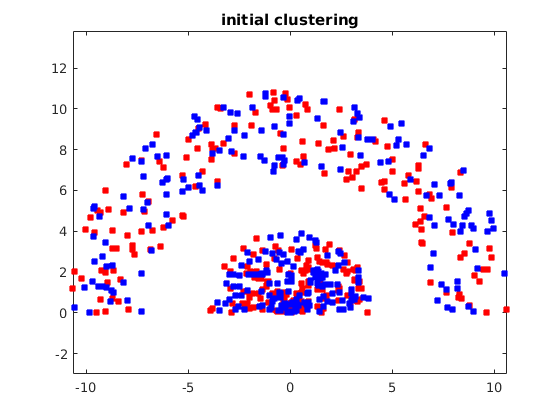
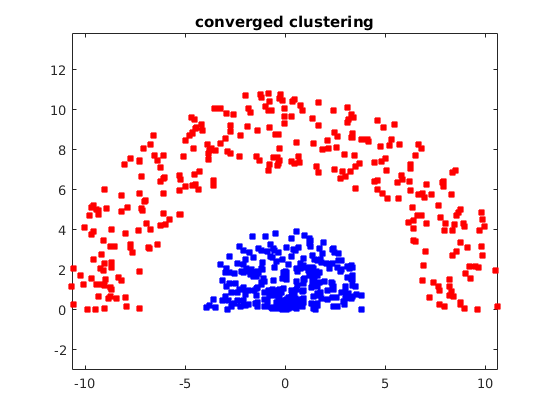
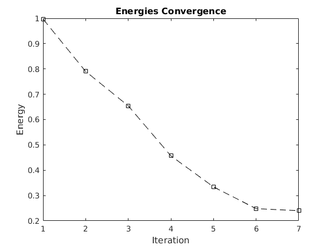
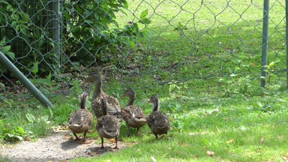
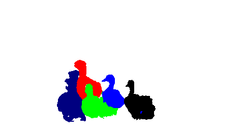

This is the code for the paper:

	"Normalized Cut Meets MRF"
	Meng Tang, Dmitrii Marin, Ismail Ben Ayed, Yuri Boykov
	In European Conference on Computer Vision (ECCV), Amsterdam, the Netherlands, October, 2016

The CORE of our algorithm is linearization or unary bound for Normalized Cut (NC).<br />
Simple implementation of such linearization is given in a FEW lines in "matlab/KernelBound.m" and "matlab/SpectralBound.m". <br />

```matlab
[ unaries ] = KernelBound( A, K, current_clustering)
% KERNELBOUND simply takes affinity, cluster number and current clustering and gives unary terms.
[ unaries ] = SpectralBound( A, K, dim, current_clustering)
% SPECTRALBOUND requires an extra argument dim, the dimensionality of spectral embedding
% When dim is the number of data points, SpectralBound is algorithmically EQUIVALENT to KernelCut.
```
Example of optimizing NC or AA (avearge association) ONLY is in **"matlab/syntheticclustering.m"**. Below is sample result with KernelCut for NC:<br />
<span>

</span>

## Motion Segmentation using KernelCut ##
Input image frames: directory "motionsegmentation/ducks01/images"  
Initial Strokes for the first frame: directory "motionsegmentation/ducks01/seedsmulti"  




Build dependency libraries (maxflow and easybmp)  
```{r, engine='bash'}
cd libs
make all
```
Build main program
```{r, engine='bash'}
cd ../kernelcut
make main
cd ../
```
Download executable for optical flow
```{r, engine='bash'}
wget http://lmb.informatik.uni-freiburg.de/resources/binaries/pami2010Linux64.zip
unzip pami2010Linux64.zip -d libs/LDOF
```
Compute optical flow
```{r, engine='bash'}
chmod +x libs/LDOF/ldof
matlab -nojvm -nosplash -nodisplay -r "cd motionsegmentation/ducks01; computeopticalflow; exit()"
```
Compute KNN graph for joint LAB + XY + M space
```{r, engine='bash'}
matlab -nojvm -nosplash -nodisplay -r "cd motionsegmentation/ducks01; getsubpixelimages; exit();"
matlab -nojvm -nosplash -nodisplay -r "cd motionsegmentation/ducks01; computeknn; exit()"
```
(Visualization of KNN graph is by clicking on image pixel, simply run motionsegmentation/visualizeknnbyclick.m)

Go to motionsegmentation/motion.sh, change codepath, and run script
```{r, engine='bash'}
chmod +x ./motionsegmentation/motion_ducks01.sh
./motionsegmentation/motion_ducks01.sh
```
Output segmentations are in the directory "motionsegmentation/ducks01/output".

(note that if initialized from seeds, the colors has to be of the following: {white,red,blue,green,black,navy})


